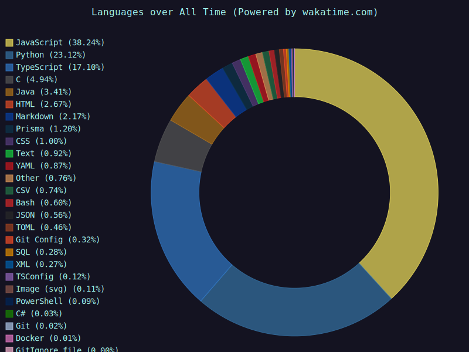

<h3>Hello, I'm Om Patil, and I specialize in:</h3>

[](https://git.io/typing-svg)

<ul>
  <li>👨‍💻 <strong>Languages</strong>: TypeScript, Python, Java, HTML, CSS</li>
  <li>💻 <strong>Frontend</strong>: React, Tailwind CSS,  </li>
  <li>🦄 <strong>Backend</strong>: Node.js, Express, Prisma, Serverless </li>
  <li>📊 <strong>Databases</strong>: MongoDB, Postgres</li>
  <li>🚀 <strong>DevOps</strong>: Nginx, Reverse Proxies</li>
  <li>📫 <strong>Contact</strong>: <a href="mailto:ompatil16022002@gmail.com">ompatil16022002@gmail.com</a></li>
</ul>


<h3>My Stats 💯</h3>



<!--  [](https://github.com/anuraghazra/github-readme-stats) -->

<!--START_SECTION:waka-->


📊 **This Week I Spent My Time On** 

```text
💬 Programming Languages: 
No Activity Tracked This Week

🔥 Editors: 
No Activity Tracked This Week

🐱‍💻 Projects: 
No Activity Tracked This Week

💻 Operating System: 
No Activity Tracked This Week
```

**I Mostly Code in Python** 

```text
Python                   16 repos            ██████████████░░░░░░░░░░░   57.14 % 
JavaScript               4 repos             ████░░░░░░░░░░░░░░░░░░░░░   14.29 % 
HTML                     3 repos             ███░░░░░░░░░░░░░░░░░░░░░░   10.71 % 
C                        2 repos             ██░░░░░░░░░░░░░░░░░░░░░░░   07.14 % 
Java                     2 repos             ██░░░░░░░░░░░░░░░░░░░░░░░   07.14 % 
```


 Last Updated on 16/08/2025 04:26:58 UTC
<!--END_SECTION:waka-->


