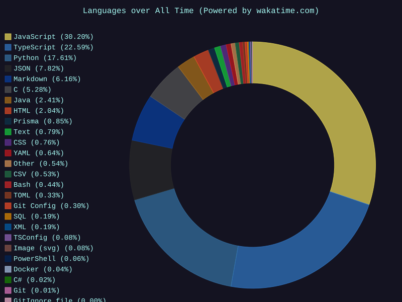

<h3>Hello, I'm Om Patil, and I specialize in:</h3>

[](https://git.io/typing-svg)

<ul>
  <li>👨‍💻 <strong>Languages</strong>: TypeScript, Python, Java, HTML, CSS</li>
  <li>💻 <strong>Frontend</strong>: React, Tailwind CSS,  </li>
  <li>🦄 <strong>Backend</strong>: Node.js, Express, Prisma, Serverless </li>
  <li>📊 <strong>Databases</strong>: MongoDB, Postgres</li>
  <li>🚀 <strong>DevOps</strong>: Nginx, Reverse Proxies</li>
  <li>📫 <strong>Contact</strong>: <a href="mailto:ompatil16022002@gmail.com">ompatil16022002@gmail.com</a></li>
</ul>


<h3>My Stats 💯</h3>



<!--  [](https://github.com/anuraghazra/github-readme-stats) -->

<!--START_SECTION:waka-->


**I'm a Night 🦉** 

```text
🌞 Morning                72 commits          ████░░░░░░░░░░░░░░░░░░░░░   17.87 % 
🌆 Daytime                124 commits         ████████░░░░░░░░░░░░░░░░░   30.77 % 
🌃 Evening                124 commits         ████████░░░░░░░░░░░░░░░░░   30.77 % 
🌙 Night                  83 commits          █████░░░░░░░░░░░░░░░░░░░░   20.60 % 
```


📊 **This Week I Spent My Time On** 

```text
🕑︎ Time Zone: Asia/Kolkata

💬 Programming Languages: 
Python                   9 mins              █████████████████████████   100.00 % 
```

🤖 **AI Coding This Week** 

```text
⏱ AI Coding Time: 9 mins (100.0%)

✍️ 122 lines written by AI, 0 lines written by hand (100.0% AI-written)

🔤 32,786 Input Tokens, 2,673 Output Tokens

💵 $0.45 Estimated AI Cost This Week

🧠 2 AI Sessions, 2 AI Prompts

GPT                      122 lines           █████████████████████████   100.00 % 

🔎 AI Coding Insights:
🤖 AI-Driven — 100.0% of written lines came from AI
📝 Concise Prompter — average 71 characters per prompt
🎯 One-Shot Prompter — average 1 prompts per session
🚀 High AI Trust — 0.0% of changed lines were hand-edited
```


<!--END_SECTION:waka-->


