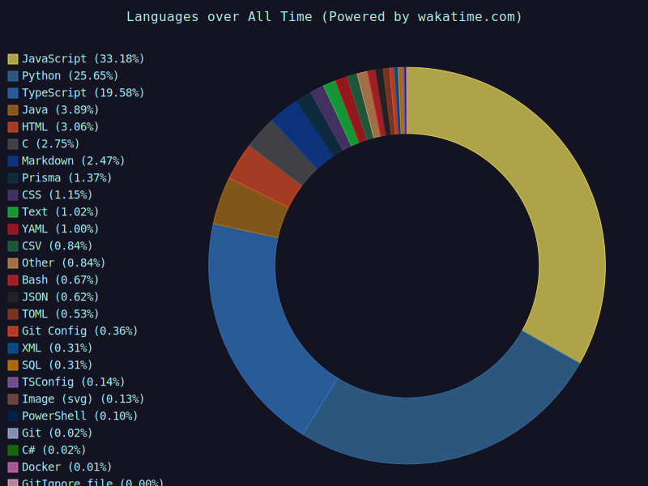

<h3> Hello, I am Om Patil and I am a</h3>

[](https://git.io/typing-svg)


- 👨‍💻 Programming Languages: Python, HTML, CSS & Javascript. 
- 💻 Frontend: HTML, CSS and React JS.
- 🦄 Frameworks: Express.
- 📫 How to reach me: ompatil16022002@gmail.com

<h3>My Stats 💯</h3>


# My Wakatime Stats



<!--  [](https://github.com/anuraghazra/github-readme-stats) -->

<!--START_SECTION:waka-->


📊 **This Week I Spent My Time On** 

```text
💬 Programming Languages: 
JavaScript               6 hrs 4 mins        ███████████████████░░░░░░   76.11 % 
HTML                     1 hr 2 mins         ███░░░░░░░░░░░░░░░░░░░░░░   13.03 % 
Markdown                 39 mins             ██░░░░░░░░░░░░░░░░░░░░░░░   08.15 % 
Bash                     9 mins              ░░░░░░░░░░░░░░░░░░░░░░░░░   01.92 % 
JSON                     2 mins              ░░░░░░░░░░░░░░░░░░░░░░░░░   00.59 % 

🔥 Editors: 
VS Code                  7 hrs 59 mins       █████████████████████████   100.00 % 

🐱‍💻 Projects: 
Web Development          7 hrs 59 mins       █████████████████████████   100.00 % 

💻 Operating System: 
Windows                  5 hrs 49 mins       ██████████████████░░░░░░░   73.03 % 
WSL                      2 hrs 9 mins        ███████░░░░░░░░░░░░░░░░░░   26.97 % 
```

**I Mostly Code in Python** 

```text
Python                   16 repos            ███████████████░░░░░░░░░░   61.54 % 
JavaScript               4 repos             ████░░░░░░░░░░░░░░░░░░░░░   15.38 % 
HTML                     3 repos             ███░░░░░░░░░░░░░░░░░░░░░░   11.54 % 
Java                     2 repos             ██░░░░░░░░░░░░░░░░░░░░░░░   07.69 % 
CSS                      1 repo              █░░░░░░░░░░░░░░░░░░░░░░░░   03.85 % 
```


 Last Updated on 18/09/2024 04:21:20 UTC
<!--END_SECTION:waka-->


